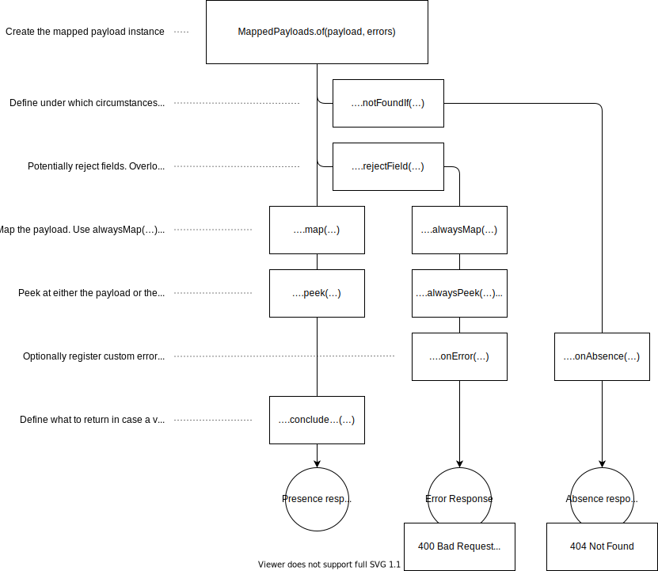

= Spring Web Tools

This is a library that provides some convenience code to make implementing Spring MVC and WebFlux controllers easier.

== A monadic MappedPayload type

Controller implementation that receive a request payload usually follow a pretty predictable set of steps handling the payload:

1. Validate the incoming payload.
2. Map it onto some domain object.
3. Invoke some business logic.
4. Produces some response based on the outcome of the business activity.

`MappedPayloads` is a monadic type that allows to set up processing pipelines in a fluent way, conclude

[source, java]
----
@RestController
class MyController {

  private final SomeRepository repository;

  @PutMapping("/payload/{id}")
  HttpEntity<?> putPayload(
    @PathVariable Long id,
    @Valid @RequestBody Something something,
    Errors errors) {

    return MappedPayload.of(something, errors)
      .notFoundIf(repository.exists(id)) // End up with a 404 if true
      .rejectField(…) // reject fields based on conditions
      .alwaysMap(it -> …) // *always* invoke business method
      .map(it -> …) // invoke business method if no errors have occured yet
      .concludeIfValid(it -> ); // Create an HTTP response using the current payload
  }
}
----

The example above will do the following:

* It will immediately flip into absent mode and will eventually produce a 404 response if the repository lookup returns `false`.
The 404 response can be customized by registering an absence handler using `….onAbsence(…)`.
* There is API to reject fields unconditionally or based on `boolean` expressions and ``Predicate``s.
* Unless we deal with absence, the handler in `….alwaysMap(…)` will be invoked.
All methods starting with `always` will be invoked, regardless of whether errors have accumulated until they're called.
* The handler passed to the `….map(…)` method, will only be invoked, if no errors have been accumulated yet.
Additional overloads exist that also receive the `Errors` instance so that additional errors can be registered manually.
* `….concludeIfValid(…)` is the terminating method to produce the success response if no errors have been accumulated until the call.
If the instance is in absent mode, a `404 Not found` will be rendered, customizable via `….onAbsence(…)`.
If errors have been accumulated, a default `400 Bad Request` will be produced to contain the `Errors` instance as payload (see <<errors>> for how that is handled).
`….onErrors(…)` can be used to customize the error response.

[[errors]]
== Serializing Error instances

`Error` instances contain binding and validation errors related to the request body.
This library provides a bit of infrastructure integration to create JSON-based responses for those.
In general, an `Errors` instance is comprised of key-value pairs.
The key is a property path expression (e.g. `username` or `address.zipCode`) of the erronerous field received.
The value is a `MessageSourceResolvable`, i.e. an abstraction that can be resolved via a `MessageSource`.
That in turn usually is a key plus optional arguments resolvable via a resource bundle.

`ErrorsModule` is a Jackson module that will turn the following arrangement:

[source, java]
----
class UserAccount {
  String password;
}

Errors errors = new BeanPropertyBindingResult(new UserAccount(), "account");
errors.rejectValue("password", "password.notNull";

// Resource bundle
password.notNull = Password must not be null!
----

into this JSON response:

[source, json]
----
{
  "password" : "Password must not be null!"
}
----

=== I18nable fields in responses

We provide a `I18nedMessage` object and a corresponding Jackson serializer that will automatically resolve the key and argument contained in the `I18nedMessage` against a resource bundle.

[source, java]
----
@Data
class ResponsePayload {
  private I18nedMessage message;
}

var payload = new ResponsePayload()
  .setMessage(I18nedMessage.of("password.notNull"));
----

Using the above mentioned resource bundle, rendering this would result in:

[source, json]
----
{
  "message" : "Password must not be null!"
}
----

== Miscellaneous

There's `ErrorsWithDetails` that allows to use the mechanism described in <<errors>> but override or add additional fields containing complex objects.

Therer's `MessageSourceResolvableHttpMessageConverter` that will resolve and render `MessageSourceResolvable` instances returned from controller methods as `text/html`.
